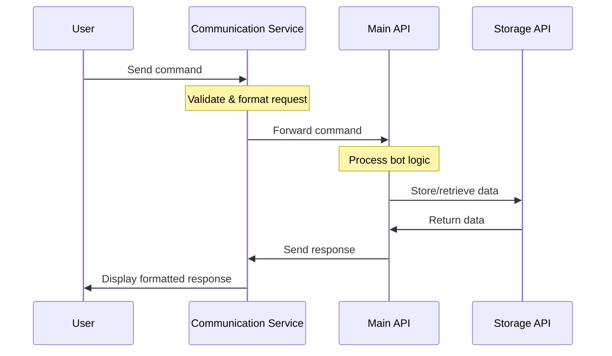
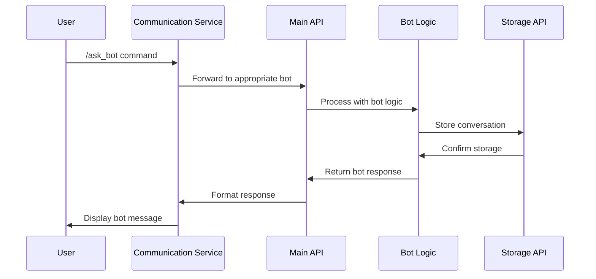
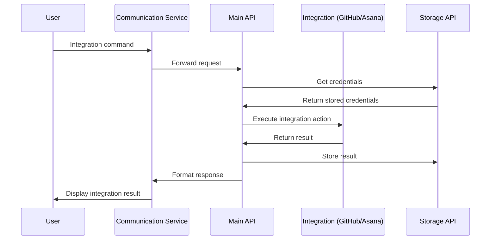

# Infoundr Agent Bots

A modular, multi-bot assistant platform for startups, supporting Open Chat, Slack, and Discord. Each service is organized in its own folder for maintainability and scalability.

## Project Structure

```
ai-agents-bots/
│
├── api/                # Main API service (Flask/FastAPI)
|   ├── icp_rust_agent/ # Rust-based API service for storage and data management
|   |   ├── src/       # Rust source code
|   |   ├── Cargo.toml # Rust dependencies and project configuration
|   |   ├── API.md     # API documentation and specifications
|   |   └── target/    # Build artifacts
│   ├── main_api.py
│   ├── requirements.txt
│   └── tokens/
│
├── open-chat/         # Open Chat service (Rust)
│   ├── src/          # Source code
│   ├── Cargo.toml    # Rust dependencies
│   └── config.toml   # Configuration
│
├── slack/              # Slack integration service
│   ├── slack_bot.py
│   ├── requirements.txt
│   └── slack_installations/
│
├── core/               # Shared logic, bots, integrations
│   ├── agent_bots.py
│   ├── project_management_bot.py
│   ├── connect_asana.py
│   ├── integrations/
│   └── knowledge_bases/
│
├── .env                # Environment variables (not committed)
├── README.md
└── requirements.txt    # (optional: root-level for dev tools)
```

## Architecture

The system consists of three main communication services and two backend services:

### Communication Services
1. **[Slack Bot](./slack/)** (`/slack`)
   - Handles Slack workspace integration
   - Processes Slack-specific commands and events
   - Forwards requests to the main API

2. **[Discord Bot](./discord-bot/)** (`/discord-bot`)
   - Manages Discord server integration
   - Processes Discord-specific commands
   - Forwards requests to the main API

3. **[Open Chat](./open-chat/)** (`/open-chat`)
   - Provides a standalone chat interface
   - Built in Rust for high performance
   - Forwards requests to the main API

### Backend Services
1. **[Main API](./api/)** (`/api`)
   - Central service that handles all bot logic
   - Provides endpoints for:
     - AI Assistant bots
     - GitHub integration
     - Project management
   - Acts as a unified interface for all communication services

2. **[Storage API](./api/icp_rust_agent/)** (`/api/icp_rust_agent`)
   - Rust-based storage service using Internet Computer Protocol (ICP)
   - Handles all data persistence
   - Provides a secure and decentralized storage solution

### Communication Flows

#### Basic Command Flow


#### Bot Interaction Flow


#### Integration Flow


## Production URLs

### Main API Service
- **URL**: http://154.38.174.112:5005
- **Endpoints**:
  - `/api/health` - Health check endpoint
  - `/api/bot_info` - List available bots
  - `/api/process_command` - Process bot commands

Check out the complete documentation [here](./api/API.md)

### Storage API Service
- **URL**: http://154.38.174.112:3005
- **Purpose**: Data persistence and storage operations
- **Endpoints**:
  - `/slack/users/:slack_id/register` - Register new Slack user
  - `/slack/users/:slack_id` - Get Slack user information
  - `/slack/messages/:slack_id` - Get/Store chat messages for Slack user
  - `/discord/users/:discord_id/register` - Register new Discord user
  - `/discord/users/:discord_id` - Get Discord user information
  - `/discord/messages/:discord_id` - Get/Store chat messages for Discord user
  - `/openchat/users/:openchat_id/register` - Register new OpenChat user
  - `/openchat/users/:openchat_id` - Get OpenChat user information
  - `/openchat/messages/:openchat_id` - Get/Store chat messages for OpenChat user

**Note**: All endpoints require authentication using an API key in the `x-api-key` header.

Check out the full documentation [here](./api/icp_rust_agent/API.md)

## Setup

1. **Clone the repository:**
   ```bash
   git clone https://github.com/Infoundr/ai-agents-bots
   cd ai-agents-bots
   ```

2. **Create and activate a virtual environment (recommended):**
   ```bash
   python3 -m venv venv
   source venv/bin/activate
   ```

3. **Install requirements for each service:**
     ```bash
     pip install -r requirements.txt
     ```

4. **Set up environment variables:**
   - Copy `.env.example` to `.env` (if provided), or create a `.env` file in the project root with the variables inside. 

## Running the Services

### 1. **API Service**
From the project root:
```bash
python -m api.main_api
```
- The API will be available at `http://localhost:5005/` 

### 2. **Slack Bot**
From the project root:
```bash
python -m slack.slack_bot
```
- The Slack bot will listen for events and commands as configured.

### 3. **(Optional) Other Integrations**
- Add and run other integrations (e.g., Discord) in their own folders, following the same pattern.

## Adding New Bots or Integrations
- Define new bots in `core/agent_bots.py`.
- Add new integrations in `core/integrations/`.
- Update the relevant service to use the new bot/integration.
