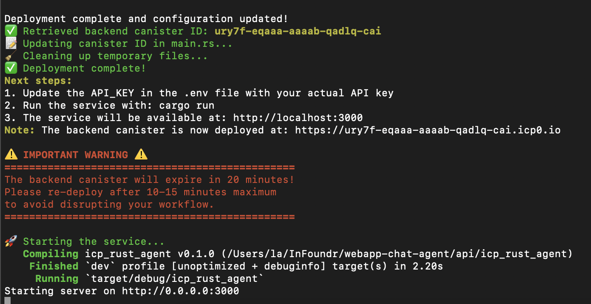

# ICP Agent API Documentation

This API provides endpoints for interacting with the Internet Computer Protocol (ICP) canister, supporting both Slack and Discord integrations.

## Development

### Getting started: 
First you'll cd into the ``api/icp_rust_agent`` directory

```bash
cd api/icp_rust_agent
```

Then run the command for deploying and setting up the API: 
```bash
./setup_locally.sh
```

Once the setup runs succesfully, this is what you'll see: 


> Note: The backend canister will expire in 20 minutes!. Please re-deploy after 10-15 minutes maximum to avoid disrupting your workflow.

You can do that by re-running ``./setup_locally.sh`` 

## Interacting with the API:
The API is now available at ``http://localhost:3000``

### Authentication
You'll copy the ``.env.example`` to a new ``.env`` file, and insert your API key there.

All API endpoints require authentication using an API key. Include the API key in the `x-api-key` header with every request. 

### How to interact with the API

#### Common Parameters

**Path Parameters:**
- `slack_id` (string): The Slack user ID (e.g., "U123456789")

**Headers:**
- `Content-Type: application/json`
- `x-api-key: your-api-key-here`

#### Register a new Slack user

#### Step 1: Store a chat message (Or Assistant Activity)
When a user sends a request from the agent bots, this is how we're storing the chat message in the backend canister

Once the message is received, this is the request you'll run to store the message. 
```bash
curl -X POST http://localhost:3000/slack/messages/U123456789 \
  -H "Content-Type: application/json" \
  -H "x-api-key: your-api-key-here" \
  -d '{
    "id": "2vxsx-fae",  
    "role": "User", 
    "content": "Hello!", 
    "question_asked": null,
    "timestamp": 1234567890,
    "bot_name": "Benny"
  }'
```

**Request Body:**
```json
{
    "id": "2vxsx-fae",  
    "role": "User", 
    "content": "Hello!", 
    "question_asked": null,
    "timestamp": 1234567890,
    "bot_name": "Benny"
}
```

Where: 
1. ``id``: is the principal ID of user. Currently it's anonymous - to represent an unauthenticated/anonymous user.
2. ``role``: Indicates who sent the message. It's an enum with two possible values:
``User``: When the message is from a human user
3. ``content``: The actual message text from the bot. In the example, it's "Hello!"
4. ``question_asked``: An optional field (can be null) that stores the original question if this message is an answer. Useful for tracking conversation context.
5. ``timestamp``: A Unix timestamp (in seconds) indicating when the message was sent. In the example, it's ``1234567890``
6. ``bot_name``: Specifies which bot/assistant sent the message. 

##### Responses: 
If you get the response: 
```json
{
    "success": true,
    "data": null,
    "error": null
}
```
It means the data was succesfully stored in the backend canister. 

To verify this, you can test out the user messages inserted by running the command: 
```bash
# Get all messages for user U123456789
curl http://localhost:3000/slack/messages/U123456789 \
  -H "x-api-key: your-api-key-here"
```

#### Step 2: Store GitHub activity:
The first step is to store the user's github token connection
```bash
curl -X POST http://localhost:3000/slack/github/U123456789/connect \
  -H "Content-Type: application/json" \
  -H "x-api-key: your-api-key-here" \
  -d '{
    "token": "your_github_token",
    "selected_repo": null
  }'
```

The second step is to store the github repository for the user: 
```bash
curl -X POST http://154.38.174.112:3000/slack/github/U123456789/repo \
  -H "Content-Type: application/json" \
  -H "x-api-key: your-api-key-here" \
  -d '"owner/repo"'
```

The third step is to store a github issue for the user
```bash
curl -X POST http://154.38.174.112:3000/slack/github/U123456789/issues \
  -H "Content-Type: application/json" \
  -H "x-api-key: your-api-key-here" \
  -d '{
    "id": "123",
    "title": "Bug fix",
    "body": "Fix the login issue",
    "repository": "owner/repo",
    "created_at": 1234567890,
    "status": "Open"
  }'
```

#### Step 3: Storing project management activity:
First thing is to store the user's asana connection: 
```bash
curl -X POST http://154.38.174.112:3000/slack/asana/U123456789/connect \
  -H "Content-Type: application/json" \
  -H "x-api-key: your-api-key-here" \
  -d '{
    "token": "your_asana_token",
    "workspace_id": "workspace123",
    "project_ids": [
        ["project1", "Project One"],
        ["project2", "Project Two"]
    ]
  }'
``` 

The second step is to store the task that has been created through ASANA
```bash
curl -X POST http://154.38.174.112:3000/slack/asana/U123456789/tasks \
  -H "Content-Type: application/json" \
  -H "x-api-key: your-api-key-here" \
  -d '{
    "id": "task123",
    "status": "active",
    "title": "Implement login feature",
    "creator": "2vxsx-fae",
    "platform_id": "asana_task_123",
    "description": "Implement user authentication",
    "platform": "asana",
    "created_at": 1234567890
  }'
```

### Error Responses

#### Authentication Error
If the API key is missing or invalid, you'll receive a response like this:
```json
{
    "success": false,
    "data": null,
    "error": "Invalid API key"
}
```

If it's any other error, the ``success`` field will be false 
```json 
{
    "success": false,
    "data": null,
    "error": "..." # Error message displayed here
}
```

<!-- ### Token Management

#### Generate Dashboard Token
```http
POST /slack/token/:slack_id
```

Generates a dashboard token for a Slack user.

**Path Parameters:**
- `slack_id` (string): The Slack user ID

**Headers:**
- `x-api-key`: Your API key

**Example:**
```bash
# Generate a token for user U123456789
curl -X POST http://localhost:3000/slack/token/U123456789 \
  -H "x-api-key: your-api-key-here"
```

**Response:**
```json
{
    "success": true,
    "data": "eyJhbGciOiJIUzI1NiIsInR5cCI6IkpXVCJ9...",
    "error": null
}
```

## GitHub Integration

### Connection Management

#### Store GitHub Connection
```http
POST /slack/github/:slack_id/connect
```

Stores a GitHub connection for a Slack user.

**Path Parameters:**
- `slack_id` (string): The Slack user ID

**Headers:**
- `Content-Type: application/json`
- `x-api-key`: Your API key

**Request Body:**
```json
{
    "token": "your_github_token",
    "selected_repo": null
}
```

**Example:**
```bash
curl -X POST http://localhost:3000/slack/github/U123456789/connect \
  -H "Content-Type: application/json" \
  -H "x-api-key: your-api-key-here" \
  -d '{
    "token": "your_github_token",
    "selected_repo": null
  }'
```

**Response:**
```json
{
    "success": true,
    "data": null,
    "error": null
}
```

#### Update Selected Repository
```http
POST /slack/github/:slack_id/repo
```

Updates the selected GitHub repository for a Slack user.

**Path Parameters:**
- `slack_id` (string): The Slack user ID

**Headers:**
- `Content-Type: application/json`
- `x-api-key`: Your API key

**Request Body:**
```json
"owner/repo"
```

**Example:**
```bash
curl -X POST http://localhost:3000/slack/github/U123456789/repo \
  -H "Content-Type: application/json" \
  -H "x-api-key: your-api-key-here" \
  -d '"owner/repo"'
```

**Response:**
```json
{
    "success": true,
    "data": null,
    "error": null
}
```

### Issue Management

#### Store GitHub Issue
```http
POST /slack/github/:slack_id/issues
```

Stores a GitHub issue for a Slack user.

**Path Parameters:**
- `slack_id` (string): The Slack user ID

**Headers:**
- `Content-Type: application/json`
- `x-api-key`: Your API key

**Request Body:**
```json
{
    "id": "123",
    "title": "Bug fix",
    "body": "Fix the login issue",
    "repository": "owner/repo",
    "created_at": 1234567890,
    "status": "Open"
}
```

**Example:**
```bash
curl -X POST http://localhost:3000/slack/github/U123456789/issues \
  -H "Content-Type: application/json" \
  -H "x-api-key: your-api-key-here" \
  -d '{
    "id": "123",
    "title": "Bug fix",
    "body": "Fix the login issue",
    "repository": "owner/repo",
    "created_at": 1234567890,
    "status": "Open"
  }'
```

**Response:**
```json
{
    "success": true,
    "data": null,
    "error": null
}
```

## Project Management (Asana)

### Connection Management

#### Store Asana Connection
```http
POST /slack/asana/:slack_id/connect
```

Stores an Asana connection for a Slack user.

**Path Parameters:**
- `slack_id` (string): The Slack user ID

**Headers:**
- `Content-Type: application/json`
- `x-api-key`: Your API key

**Request Body:**
```json
{
    "token": "your_asana_token",
    "workspace_id": "workspace123",
    "project_ids": [
        ["project1", "Project One"],
        ["project2", "Project Two"]
    ]
}
```

**Example:**
```bash
curl -X POST http://localhost:3000/slack/asana/U123456789/connect \
  -H "Content-Type: application/json" \
  -H "x-api-key: your-api-key-here" \
  -d '{
    "token": "your_asana_token",
    "workspace_id": "workspace123",
    "project_ids": [
        ["project1", "Project One"],
        ["project2", "Project Two"]
    ]
  }'
```

**Response:**
```json
{
    "success": true,
    "data": null,
    "error": null
}
```

### Task Management

#### Store Asana Task
```http
POST /slack/asana/:slack_id/tasks
```

Stores an Asana task for a Slack user.

**Path Parameters:**
- `slack_id` (string): The Slack user ID

**Headers:**
- `Content-Type: application/json`
- `x-api-key`: Your API key

**Request Body:**
```json
{
    "id": "task123",
    "status": "active",
    "title": "Implement login feature",
    "creator": "2vxsx-fae",
    "platform_id": "asana_task_123",
    "description": "Implement user authentication",
    "platform": "asana",
    "created_at": 1234567890
}
```

**Example:**
```bash
curl -X POST http://localhost:3000/slack/asana/U123456789/tasks \
  -H "Content-Type: application/json" \
  -H "x-api-key: your-api-key-here" \
  -d '{
    "id": "task123",
    "status": "active",
    "title": "Implement login feature",
    "creator": "2vxsx-fae",
    "platform_id": "asana_task_123",
    "description": "Implement user authentication",
    "platform": "asana",
    "created_at": 1234567890
  }'
```

**Response:**
```json
{
    "success": true,
    "data": null,
    "error": null
}
```

## Error Handling

All endpoints return responses in the following format:
```json
{
    "success": boolean,
    "data": any | null,
    "error": string | null
}
```

### Example Error Response
```json
{
    "success": false,
    "data": null,
    "error": "Failed to store message: Invalid message format"
}
```

## Data Types

### MessageRole
```rust
enum MessageRole {
    User,
    Assistant
}
```

### ChatMessage
```rust
struct ChatMessage {
    id: Principal,
    role: MessageRole,
    content: String,
    question_asked: Option<String>,
    timestamp: u64,
    bot_name: Option<String>
}
```

### UserIdentifier
```rust
enum UserIdentifier {
    Principal(Principal),
    OpenChatId(String),
    SlackId(String),
    DiscordId(String)
}
```

### GitHubConnection
```rust
struct GitHubConnection {
    timestamp: u64,
    token: String,
    selected_repo: Option<String>
}
```

### GitHubIssue
```rust
struct GitHubIssue {
    id: String,
    title: String,
    body: String,
    repository: String,
    created_at: u64,
    status: IssueStatus
}

enum IssueStatus {
    Open,
    Closed
}
```

### AsanaConnection
```rust
struct AsanaConnection {
    token: String,
    workspace_id: String,
    project_ids: Vec<(String, String)> // (project_id, project_name)
}
```

### AsanaTask
```rust
struct AsanaTask {
    id: String,
    status: String,
    title: String,
    creator: Principal,
    platform_id: String,
    description: String,
    platform: String,
    created_at: u64
}
``` -->

<!-- ## Testing the API

Here's a complete sequence of commands to test the API:

```bash
# 1. Register a new user
curl -X POST http://localhost:3000/slack/users/U123456789/register \
  -H "x-api-key: your-api-key-here"

# 2. Verify user registration
curl http://localhost:3000/slack/users/U123456789 \
  -H "x-api-key: your-api-key-here"

# 3. Store a user message
curl -X POST http://localhost:3000/slack/messages/U123456789 \
  -H "Content-Type: application/json" \
  -H "x-api-key: your-api-key-here" \
  -d '{
    "id": "2vxsx-fae",
    "role": "User",
    "content": "Hello!",
    "question_asked": null,
    "timestamp": 1234567890,
    "bot_name": null
  }'

# 4. Store an assistant response
curl -X POST http://localhost:3000/slack/messages/U123456789 \
  -H "Content-Type: application/json" \
  -H "x-api-key: your-api-key-here" \
  -d '{
    "id": "2vxsx-fae",
    "role": "Assistant",
    "content": "Hi there! How can I help you today?",
    "question_asked": "Hello!",
    "timestamp": 1234567891,
    "bot_name": "AI Assistant"
  }'

# 5. Retrieve all messages
curl http://localhost:3000/slack/messages/U123456789 \
  -H "x-api-key: your-api-key-here"

# 6. Generate a dashboard token
curl -X POST http://localhost:3000/slack/token/U123456789 \
  -H "x-api-key: your-api-key-here"

# 7. Connect GitHub
curl -X POST http://localhost:3000/slack/github/U123456789/connect \
  -H "Content-Type: application/json" \
  -H "x-api-key: your-api-key-here" \
  -d '{
    "token": "your_github_token",
    "selected_repo": null
  }'

# 8. Store GitHub issue
curl -X POST http://localhost:3000/slack/github/U123456789/issues \
  -H "Content-Type: application/json" \
  -H "x-api-key: your-api-key-here" \
  -d '{
    "id": "123",
    "title": "Bug fix",
    "body": "Fix the login issue",
    "repository": "owner/repo",
    "created_at": 1234567890,
    "status": "Open"
  }'

# 9. Connect Asana
curl -X POST http://localhost:3000/slack/asana/U123456789/connect \
  -H "Content-Type: application/json" \
  -H "x-api-key: your-api-key-here" \
  -d '{
    "token": "your_asana_token",
    "workspace_id": "workspace123",
    "project_ids": [
        ["project1", "Project One"],
        ["project2", "Project Two"]
    ]
  }'

# 10. Store Asana task
curl -X POST http://localhost:3000/slack/asana/U123456789/tasks \
  -H "Content-Type: application/json" \
  -H "x-api-key: your-api-key-here" \
  -d '{
    "id": "task123",
    "status": "active",
    "title": "Implement login feature",
    "creator": "2vxsx-fae",
    "platform_id": "asana_task_123",
    "description": "Implement user authentication",
    "platform": "asana",
    "created_at": 1234567890
  }'
```  -->

## Pushing to production

### Base URL
The main URL for production is: 
```
http://154.38.174.112:3000
```

<!-- ### Authentication

All API endpoints require authentication using an API key. Include the API key in the `x-api-key` header with every request:

```bash
curl -H "x-api-key: your-api-key-here" ...
```

### Error Responses

#### Authentication Error
If the API key is missing or invalid, you'll receive a response like this:
```json
{
    "success": false,
    "data": null,
    "error": "Invalid API key"
}
```

### Quick Examples

#### Register a new Slack user
```bash
curl -X POST http://154.38.174.112:3000/slack/users/U123456789/register \
  -H "x-api-key: your-api-key-here"
```

#### Get user information
```bash
curl http://154.38.174.112:3000/slack/users/U123456789 \
  -H "x-api-key: your-api-key-here"
```

#### Store a chat message
```bash
curl -X POST http://154.38.174.112:3000/slack/messages/U123456789 \
  -H "Content-Type: application/json" \
  -H "x-api-key: your-api-key-here" \
  -d '{
    "id": "2vxsx-fae",
    "role": "User",
    "content": "Hello!",
    "question_asked": null,
    "timestamp": 1234567890,
    "bot_name": null
  }'
```

### Slack Integration

### User Management

#### Register Slack User
```http
POST /slack/users/:slack_id/register
```

Registers a new Slack user in the system.

**Path Parameters:**
- `slack_id` (string): The Slack user ID

**Headers:**
- `x-api-key`: Your API key

**Example:**
```bash
# Register a new user with ID U123456789
curl -X POST http://154.38.174.112:3000/slack/users/U123456789/register \
  -H "x-api-key: your-api-key-here"
```

**Response:**
```json
{
    "success": true,
    "data": null,
    "error": null
}
```

#### Get Slack User
```http
GET /slack/users/:slack_id
```

Retrieves information about a registered Slack user.

**Path Parameters:**
- `slack_id` (string): The Slack user ID

**Headers:**
- `x-api-key`: Your API key

**Example:**
```bash
# Get information for user U123456789
curl http://154.38.174.112:3000/slack/users/U123456789 \
  -H "x-api-key: your-api-key-here"
```

**Response:**
```json
{
    "success": true,
    "data": {
        "slack_id": "U123456789",
        "site_principal": null,
        "display_name": null,
        "team_id": null
    },
    "error": null
}
```

### Message Management

#### Get Chat Messages
```http
GET /slack/messages/:slack_id
```

Retrieves all chat messages for a Slack user.

**Path Parameters:**
- `slack_id` (string): The Slack user ID

**Headers:**
- `x-api-key`: Your API key

**Example:**
```bash
# Get all messages for user U123456789
curl http://154.38.174.112:3000/slack/messages/U123456789 \
  -H "x-api-key: your-api-key-here"
```

**Response:**
```json
{
    "success": true,
    "data": [
        {
            "id": "2vxsx-fae",
            "role": "User",
            "content": "Hello!",
            "question_asked": null,
            "timestamp": 1234567890,
            "bot_name": null
        }
    ],
    "error": null
}
```

#### Store Chat Message
```http
POST /slack/messages/:slack_id
```

Stores a chat message in the system.

**Path Parameters:**
- `slack_id` (string): The Slack user ID

**Headers:**
- `Content-Type: application/json`
- `x-api-key`: Your API key

**Example:**
```bash
# Store a user message
curl -X POST http://154.38.174.112:3000/slack/messages/U123456789 \
  -H "Content-Type: application/json" \
  -H "x-api-key: your-api-key-here" \
  -d '{
    "id": "2vxsx-fae",
    "role": "User",
    "content": "Hello!",
    "question_asked": null,
    "timestamp": 1234567890,
    "bot_name": null
  }'

# Store an assistant message
curl -X POST http://154.38.174.112:3000/slack/messages/U123456789 \
  -H "Content-Type: application/json" \
  -H "x-api-key: your-api-key-here" \
  -d '{
    "id": "2vxsx-fae",
    "role": "Assistant",
    "content": "Hi there! How can I help you today?",
    "question_asked": "Hello!",
    "timestamp": 1234567891,
    "bot_name": "AI Assistant"
  }'
```

**Response:**
```json
{
    "success": true,
    "data": null,
    "error": null
}
```

### Token Management

#### Generate Dashboard Token
```http
POST /slack/token/:slack_id
```

Generates a dashboard token for a Slack user.

**Path Parameters:**
- `slack_id` (string): The Slack user ID

**Headers:**
- `x-api-key`: Your API key

**Example:**
```bash
# Generate a token for user U123456789
curl -X POST http://154.38.174.112:3000/slack/token/U123456789 \
  -H "x-api-key: your-api-key-here"
```

**Response:**
```json
{
    "success": true,
    "data": "eyJhbGciOiJIUzI1NiIsInR5cCI6IkpXVCJ9...",
    "error": null
}
```

## GitHub Integration

### Connection Management

#### Store GitHub Connection
```http
POST /slack/github/:slack_id/connect
```

Stores a GitHub connection for a Slack user.

**Path Parameters:**
- `slack_id` (string): The Slack user ID

**Headers:**
- `Content-Type: application/json`
- `x-api-key`: Your API key

**Request Body:**
```json
{
    "token": "your_github_token",
    "selected_repo": null
}
```

**Example:**
```bash
curl -X POST http://154.38.174.112:3000/slack/github/U123456789/connect \
  -H "Content-Type: application/json" \
  -H "x-api-key: your-api-key-here" \
  -d '{
    "token": "your_github_token",
    "selected_repo": null
  }'
```

**Response:**
```json
{
    "success": true,
    "data": null,
    "error": null
}
```

#### Update Selected Repository
```http
POST /slack/github/:slack_id/repo
```

Updates the selected GitHub repository for a Slack user.

**Path Parameters:**
- `slack_id` (string): The Slack user ID

**Headers:**
- `Content-Type: application/json`
- `x-api-key`: Your API key

**Request Body:**
```json
"owner/repo"
```

**Example:**
```bash
curl -X POST http://154.38.174.112:3000/slack/github/U123456789/repo \
  -H "Content-Type: application/json" \
  -H "x-api-key: your-api-key-here" \
  -d '"owner/repo"'
```

**Response:**
```json
{
    "success": true,
    "data": null,
    "error": null
}
```

### Issue Management

#### Store GitHub Issue
```http
POST /slack/github/:slack_id/issues
```

Stores a GitHub issue for a Slack user.

**Path Parameters:**
- `slack_id` (string): The Slack user ID

**Headers:**
- `Content-Type: application/json`
- `x-api-key`: Your API key

**Request Body:**
```json
{
    "id": "123",
    "title": "Bug fix",
    "body": "Fix the login issue",
    "repository": "owner/repo",
    "created_at": 1234567890,
    "status": "Open"
}
```

**Example:**
```bash
curl -X POST http://154.38.174.112:3000/slack/github/U123456789/issues \
  -H "Content-Type: application/json" \
  -H "x-api-key: your-api-key-here" \
  -d '{
    "id": "123",
    "title": "Bug fix",
    "body": "Fix the login issue",
    "repository": "owner/repo",
    "created_at": 1234567890,
    "status": "Open"
  }'
```

**Response:**
```json
{
    "success": true,
    "data": null,
    "error": null
}
```

## Project Management (Asana)

### Connection Management

#### Store Asana Connection
```http
POST /slack/asana/:slack_id/connect
```

Stores an Asana connection for a Slack user.

**Path Parameters:**
- `slack_id` (string): The Slack user ID

**Headers:**
- `Content-Type: application/json`
- `x-api-key`: Your API key

**Request Body:**
```json
{
    "token": "your_asana_token",
    "workspace_id": "workspace123",
    "project_ids": [
        ["project1", "Project One"],
        ["project2", "Project Two"]
    ]
}
```

**Example:**
```bash
curl -X POST http://154.38.174.112:3000/slack/asana/U123456789/connect \
  -H "Content-Type: application/json" \
  -H "x-api-key: your-api-key-here" \
  -d '{
    "token": "your_asana_token",
    "workspace_id": "workspace123",
    "project_ids": [
        ["project1", "Project One"],
        ["project2", "Project Two"]
    ]
  }'
```

**Response:**
```json
{
    "success": true,
    "data": null,
    "error": null
}
```

### Task Management

#### Store Asana Task
```http
POST /slack/asana/:slack_id/tasks
```

Stores an Asana task for a Slack user.

**Path Parameters:**
- `slack_id` (string): The Slack user ID

**Headers:**
- `Content-Type: application/json`
- `x-api-key`: Your API key

**Request Body:**
```json
{
    "id": "task123",
    "status": "active",
    "title": "Implement login feature",
    "creator": "2vxsx-fae",
    "platform_id": "asana_task_123",
    "description": "Implement user authentication",
    "platform": "asana",
    "created_at": 1234567890
}
```

**Example:**
```bash
curl -X POST http://154.38.174.112:3000/slack/asana/U123456789/tasks \
  -H "Content-Type: application/json" \
  -H "x-api-key: your-api-key-here" \
  -d '{
    "id": "task123",
    "status": "active",
    "title": "Implement login feature",
    "creator": "2vxsx-fae",
    "platform_id": "asana_task_123",
    "description": "Implement user authentication",
    "platform": "asana",
    "created_at": 1234567890
  }'
```

**Response:**
```json
{
    "success": true,
    "data": null,
    "error": null
}
```

## Error Handling

All endpoints return responses in the following format:
```json
{
    "success": boolean,
    "data": any | null,
    "error": string | null
}
```

### Example Error Response
```json
{
    "success": false,
    "data": null,
    "error": "Failed to store message: Invalid message format"
}
```

## Data Types

### MessageRole
```rust
enum MessageRole {
    User,
    Assistant
}
```

### ChatMessage
```rust
struct ChatMessage {
    id: Principal,
    role: MessageRole,
    content: String,
    question_asked: Option<String>,
    timestamp: u64,
    bot_name: Option<String>
}
```

### UserIdentifier
```rust
enum UserIdentifier {
    Principal(Principal),
    OpenChatId(String),
    SlackId(String),
    DiscordId(String)
}
```

### GitHubConnection
```rust
struct GitHubConnection {
    timestamp: u64,
    token: String,
    selected_repo: Option<String>
}
```

### GitHubIssue
```rust
struct GitHubIssue {
    id: String,
    title: String,
    body: String,
    repository: String,
    created_at: u64,
    status: IssueStatus
}

enum IssueStatus {
    Open,
    Closed
}
```

### AsanaConnection
```rust
struct AsanaConnection {
    token: String,
    workspace_id: String,
    project_ids: Vec<(String, String)> // (project_id, project_name)
}
```

### AsanaTask
```rust
struct AsanaTask {
    id: String,
    status: String,
    title: String,
    creator: Principal,
    platform_id: String,
    description: String,
    platform: String,
    created_at: u64
}
```

## Testing the API

Here's a complete sequence of commands to test the API:

```bash
# 1. Register a new user
curl -X POST http://154.38.174.112:3000/slack/users/U123456789/register \
  -H "x-api-key: your-api-key-here"

# 2. Verify user registration
curl http://154.38.174.112:3000/slack/users/U123456789 \
  -H "x-api-key: your-api-key-here"

# 3. Store a user message
curl -X POST http://154.38.174.112:3000/slack/messages/U123456789 \
  -H "Content-Type: application/json" \
  -H "x-api-key: your-api-key-here" \
  -d '{
    "id": "2vxsx-fae",
    "role": "User",
    "content": "Hello!",
    "question_asked": null,
    "timestamp": 1234567890,
    "bot_name": null
  }'

# 4. Store an assistant response
curl -X POST http://154.38.174.112:3000/slack/messages/U123456789 \
  -H "Content-Type: application/json" \
  -H "x-api-key: your-api-key-here" \
  -d '{
    "id": "2vxsx-fae",
    "role": "Assistant",
    "content": "Hi there! How can I help you today?",
    "question_asked": "Hello!",
    "timestamp": 1234567891,
    "bot_name": "AI Assistant"
  }'

# 5. Retrieve all messages
curl http://154.38.174.112:3000/slack/messages/U123456789 \
  -H "x-api-key: your-api-key-here"

# 6. Generate a dashboard token
curl -X POST http://154.38.174.112:3000/slack/token/U123456789 \
  -H "x-api-key: your-api-key-here"

# 7. Connect GitHub
curl -X POST http://154.38.174.112:3000/slack/github/U123456789/connect \
  -H "Content-Type: application/json" \
  -H "x-api-key: your-api-key-here" \
  -d '{
    "token": "your_github_token",
    "selected_repo": null
  }'

# 8. Store GitHub issue
curl -X POST http://154.38.174.112:3000/slack/github/U123456789/issues \
  -H "Content-Type: application/json" \
  -H "x-api-key: your-api-key-here" \
  -d '{
    "id": "123",
    "title": "Bug fix",
    "body": "Fix the login issue",
    "repository": "owner/repo",
    "created_at": 1234567890,
    "status": "Open"
  }'

# 9. Connect Asana
curl -X POST http://154.38.174.112:3000/slack/asana/U123456789/connect \
  -H "Content-Type: application/json" \
  -H "x-api-key: your-api-key-here" \
  -d '{
    "token": "your_asana_token",
    "workspace_id": "workspace123",
    "project_ids": [
        ["project1", "Project One"],
        ["project2", "Project Two"]
    ]
  }'

# 10. Store Asana task
curl -X POST http://154.38.174.112:3000/slack/asana/U123456789/tasks \
  -H "Content-Type: application/json" \
  -H "x-api-key: your-api-key-here" \
  -d '{
    "id": "task123",
    "status": "active",
    "title": "Implement login feature",
    "creator": "2vxsx-fae",
    "platform_id": "asana_task_123",
    "description": "Implement user authentication",
    "platform": "asana",
    "created_at": 1234567890
  }'
``` -->