# Instructions on interacting with our Infoundr bot: 

Meet Infoundr - a suite of AI-powered bots modeled after successful entrepreneurs. Get personalized guidance on critical thinking, innovation, and business strategy from AI assistants that understand your unique challenges.

### Understanding the different commands: 

1. Type the ``/help`` command to see the different commands available. 
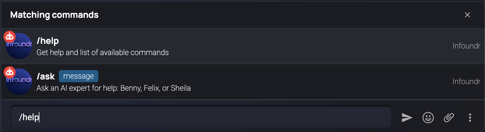

This is what you'll see in the chat: 


Now you can familiarize yourself with the different commands by reading the help response. 

#### Section A: Interacting with the ``Expert Bots``: 
These are specialized bots designed to support every aspect of your business

You'll type ``/ask`` command in the chat to interact with the expert bots. 


The popup will appear and you can ask questions to the expert bots. This is the format you'll use: 
```bash
Format: [Expert Name] - [Your Question]
```

These are the experts available: 
```bash
• Beniah (Founder of Payd) - Bot Name: Benny
• Innocent Mangothe (Founder of Startinev) - Bot Name: Uncle Startups
• Dean Gichuki (Founder of Quick API) - Bot Name: Dean
• Sheila Waswa (Founder of Chasing Maverick) - Bot Name: Sheila
• Felix Macharia (Founder of KotaniPay) - Bot Name: Felix
```

Example: 
```bash
Benny - How do I go about raising for my fintech startup? # This is the question you're asking Benny
Felix - How do I navigate regulation in Africa for my crypto startup? # This is the question you're asking Felix
```


Then the bot will send the request to the expert, this loading element will appear: 

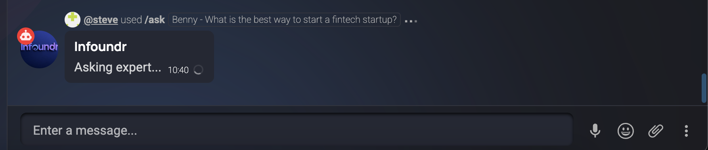

Once the expert has responded, the bot will send the response back to you: 


#### Section B: Interacting with the ``Project Management Bot``: 
This bot allows you to manage tasks directly on open chat

You'll type ``/project`` command in the chat to interact with the project management bot. 

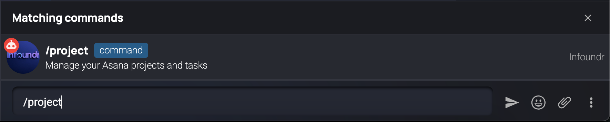

The frist step is to connect your asana account to the bot for you to use it. You'll get your asana token from the [developer console](https://app.asana.com/0/developer-console) in Asana 

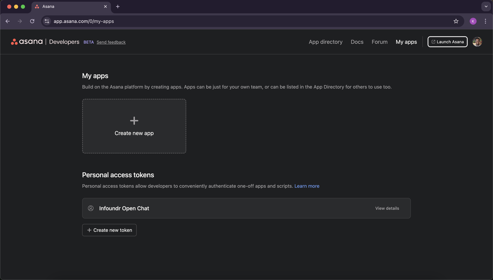

You will click on ``Create new token`` and then copy the token. 


You will then paste the token in the ``/project`` popup command in the chat. 


You will then get a response in the chat: 

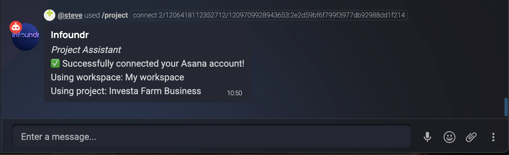

Now create your first task by typing ``/project`` then ``create [description]``


You will get the loading element again. And once your task is created succesfully, you'll get a response in the chat: 

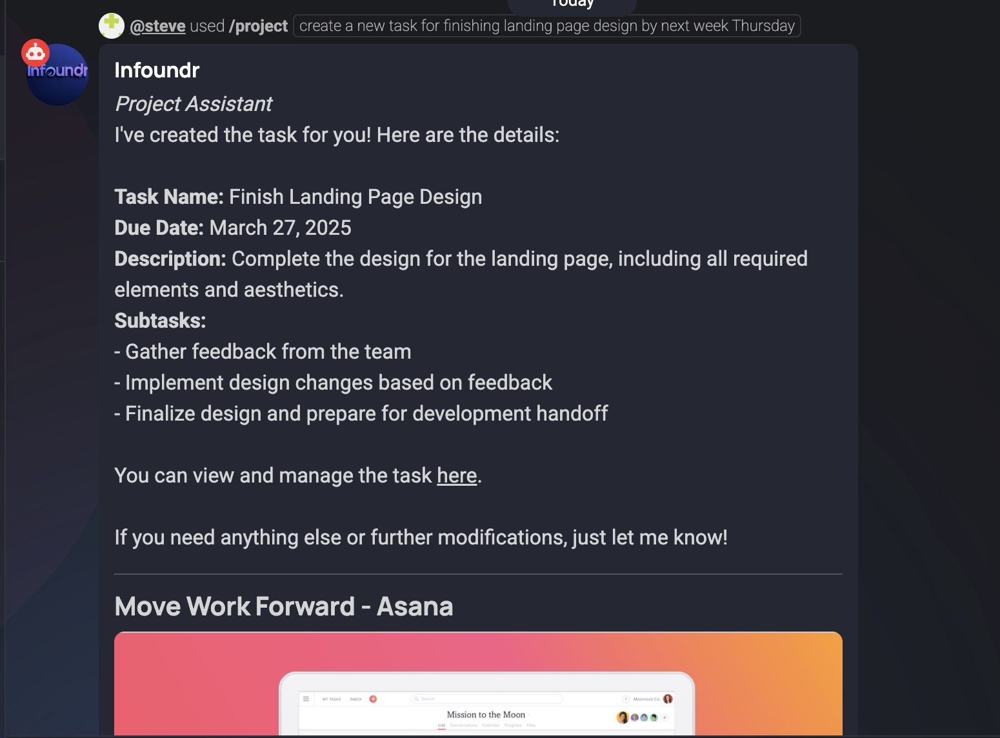

You can now click on the ``here`` link to view your task in your asana account. 

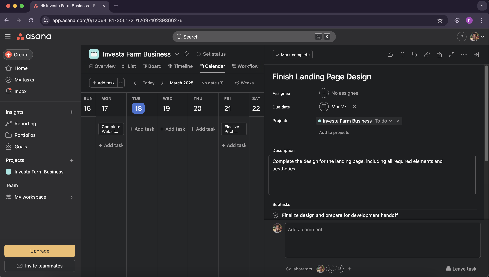

The next step is to check out the tasks that are available on your asana account. You can do this by typing ``/project`` then ``list``


You will get the loading element again. And once your task is created succesfully, you'll get a response in the chat: 


You can now see the tasks that are available on your asana account. 

#### Section C: Interacting with the ``GitHub Bot``: 
This bot allows you to manage github issues and pull requests directly inside open chat

You'll type ``/github`` command in the chat to interact with the GitHub bot. 

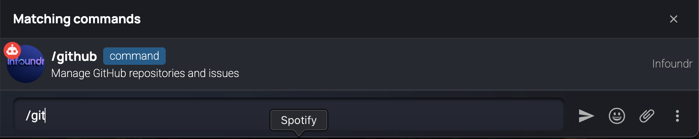

You will get a popup to connect your GitHub account to the bot. 

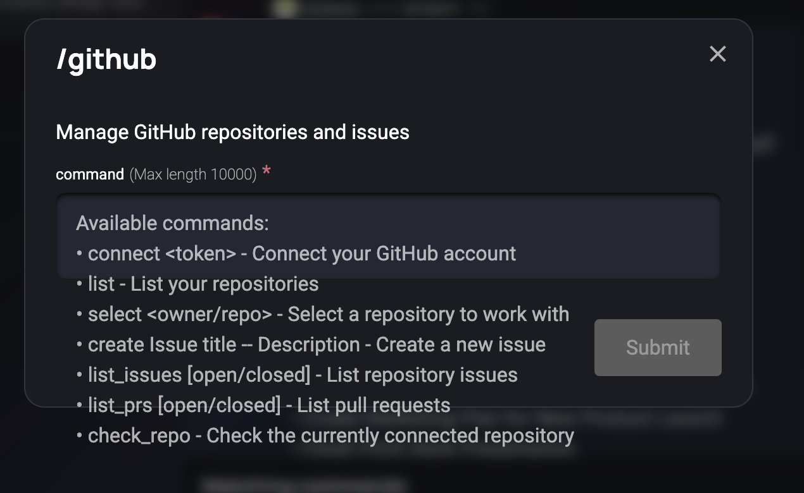

The first step is to create a personal access token from GitHub to connect your account to the bot. 

You can do this by going to your [GitHub account settings](https://github.com/settings/personal-access-tokens) and then generating a token. 

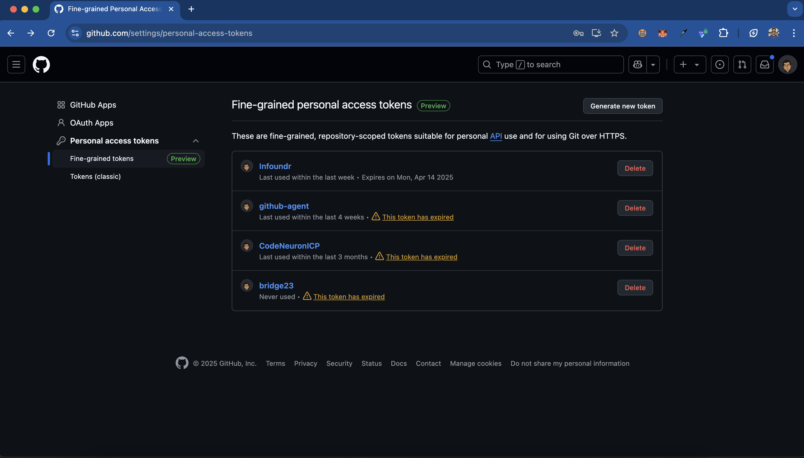

Click on ``Generate New Token`` and then once you've added ``Token Name`` and ``Token Description``, allow the following permissions: 
   - In the ``Repository Access``, select ``All Repositories``
   - In the ``Permissions``, select ``Repository Permissions`` and select ``Read and Write`` for all the permissions that you'd like to allow the bot to have. But the main ones are ``Issues`` and ``Pull Requests``.

Once you're done click on ``Generate Token`` and then copy the token, since you won't be able to see it again. 


You will then paste the token in the ``/github`` popup command in the chat. 

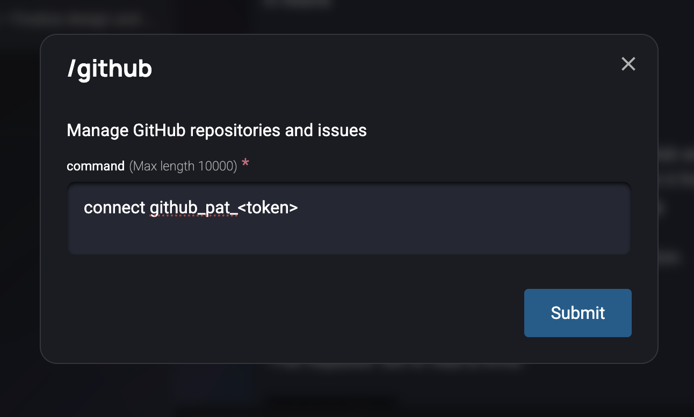

Once you've done this, you'll get a response in the chat: 

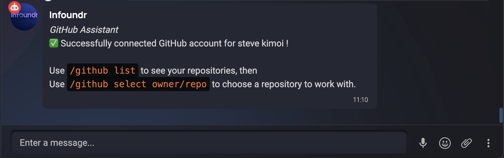

You can start by running the command ``/github list`` to see all the repositories that you have access to. 

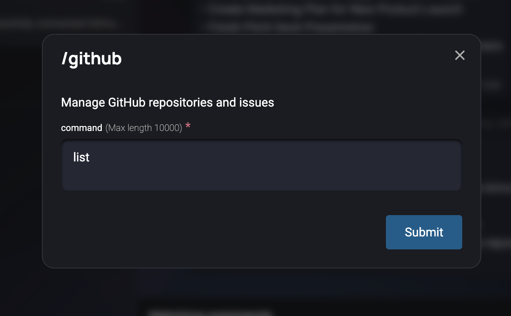

You will get the loading element again. And once the repositories are listed succesfully, you'll get a response in the chat: 

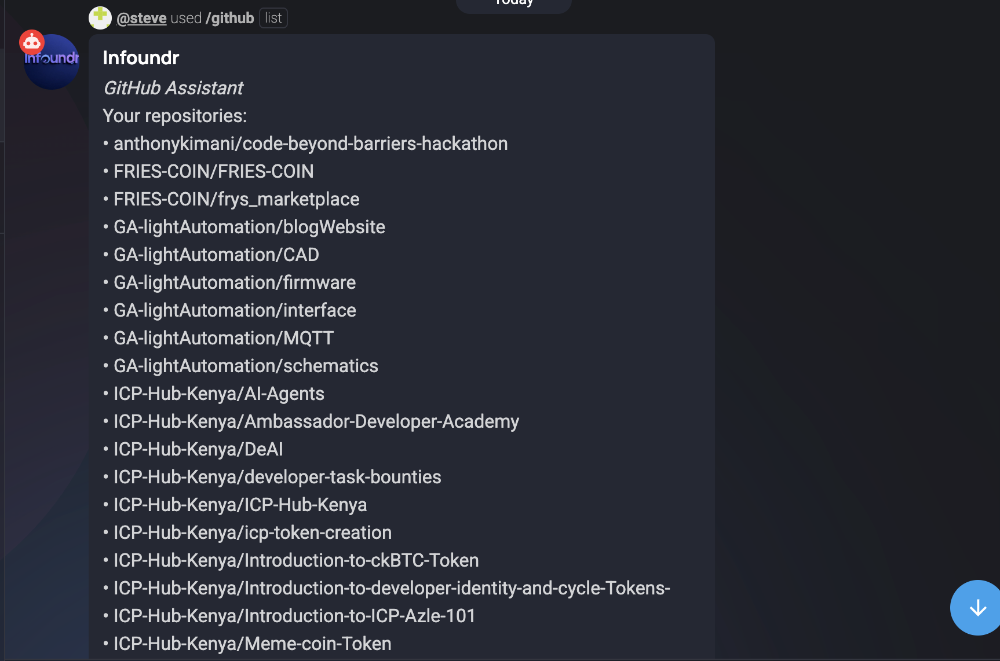

The next step is to connect your repository to the bot. You can do this by typing ``/github select owner/repo``. You can directly copy the owner/repo from the list of repositories. 


This is the response you'll get in the chat if the repository is connected succesfully: 

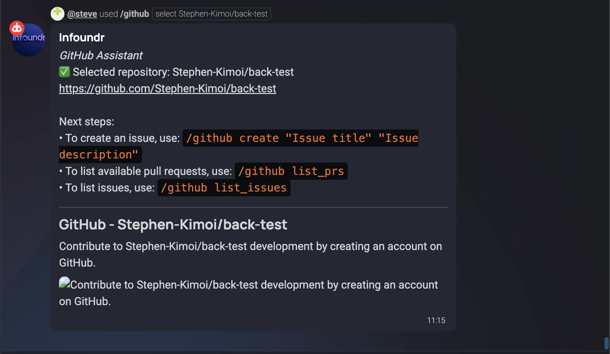

You can now create a new issue by typing ``/github create issue title -- Description``. 

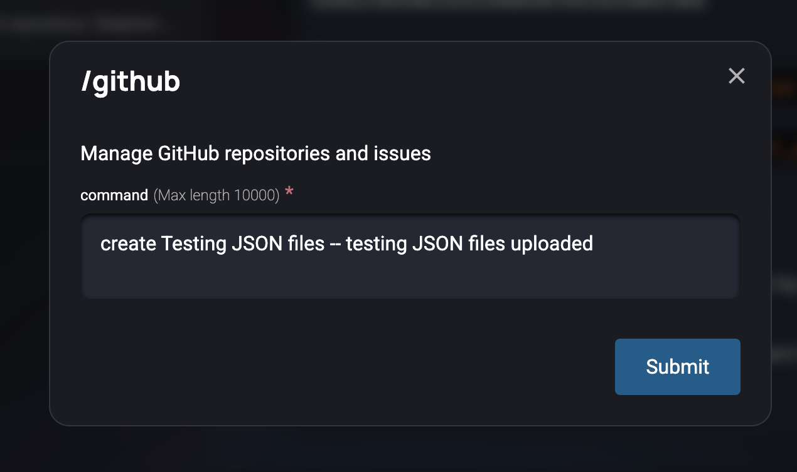

You will get the loading element again. And once the issue is created succesfully, you'll get a response in the chat: 


You can now see the issue in your repository. 


To list issues in your repository, you can type ``/github list issues``. 

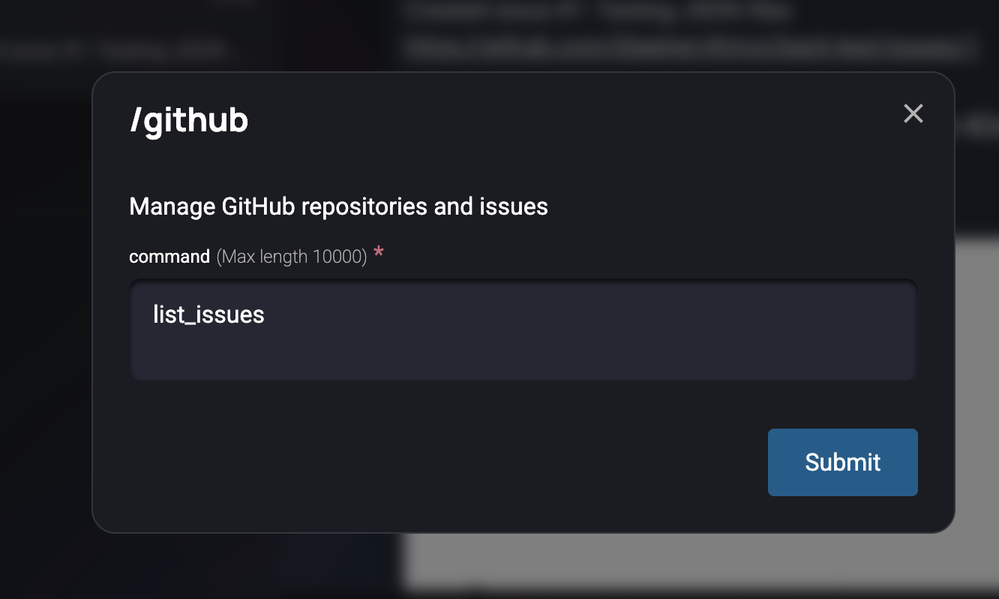

You will get the loading element again. And once the issues are listed succesfully, you'll get a response in the chat: 

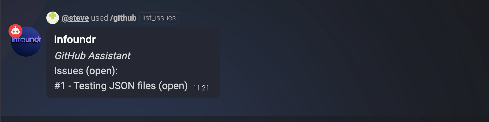

And with that you've successfully tested out the ``Infoundr OpenChat Bot``.  


