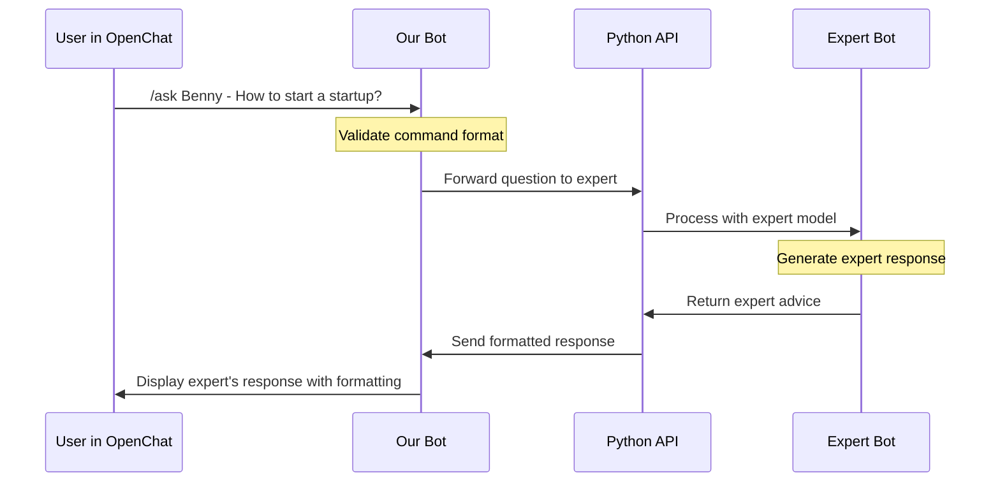
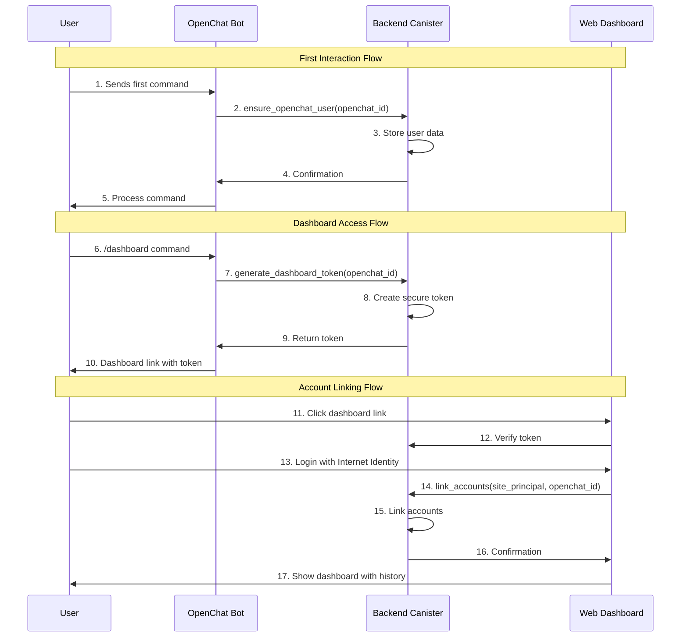

# Understanding the OpenChat Bot Implementation

This document explains how our OpenChat bot works under the hood, breaking down the main components and their interactions.

## Overview

Our bot acts as a bridge between OpenChat and our Python-based expert bots. Think of it like a translator that:
1. Understands OpenChat's language (protocol)
2. Forwards messages to our expert bots
3. Translates their responses back to OpenChat's format

## Key Components

### 1. Configuration (config.rs)

The `config.rs` file handles all the bot's settings. Think of it as the bot's control panel:

```rust
pub struct Config {
    pub pem_file: String,        // Bot's identity (like its passport)
    pub ic_url: String,          // Where to find OpenChat
    pub oc_public_key: String,   // OpenChat's identity verification key
    pub port: u16,              // Which door our bot listens on
    pub python_api_url: String,  // Where to find our expert bots
    pub log_level: Level,       // How much detail to log
}
```

When the bot starts, it reads these settings from `config.toml` - like reading a configuration manual before starting a machine.

### 2. Main Bot Logic (main.rs)

The main.rs file contains several important parts:

#### a. State Management
```rust
struct AppState {
    oc_public_key: String,
    commands: CommandHandlerRegistry<AgentRuntime>,
    python_api_url: String,
    http_client: ReqwestClient,
}
```
This is like the bot's brain - it keeps track of:
- How to verify messages from OpenChat
- What commands are available
- How to talk to our Python bots

#### b. Message Structures
```rust
struct PythonBotResponse {
    text: String,
    bot_name: String,
}
```
These define how messages look when going between different parts of the system.

## How It Works

### 1. Startup Process

When you run `cargo run`, the bot:
1. Reads its configuration from `config.toml`
2. Connects to the Python API to discover available expert bots
3. Sets up command handlers for each expert
4. Starts listening for OpenChat messages

### 2. Handling Commands

When someone in OpenChat types a command like `/ask_benny How do I start a startup?`:

1. **Receiving the Command**
   - OpenChat sends the command to our bot
   - The bot verifies it's really from OpenChat using the public key

2. **Processing the Command**
   ```rust
   async fn execute_command(State(state): State<Arc<AppState>>, jwt: String)
   ```
   - Extracts the question and which expert it's for
   - Forwards it to our Python API

3. **Getting the Response**
   - The Python API returns the expert's answer
   - The bot formats it nicely for OpenChat
   - Sends it back to the chat

### 3. Command Registration

When the bot starts, it creates commands for each expert:
```rust
for (bot_name, _info) in bot_info.iter() {
    let command_name = format!("ask_{}", bot_name.to_lowercase());
    // Register command...
}
```

This is like creating a menu of available experts that users can ask questions to.

## Flow Diagram


## Bot-to-Dashboard Integration Flow



## Error Handling

The bot handles various problems that might occur:
- If OpenChat is unreachable
- If the Python API doesn't respond
- If a command is invalid
- If authentication fails

It logs these issues and sends appropriate error messages back to users.

## Security

The bot maintains security through:
1. JWT verification for OpenChat commands
2. Secure private key storage (PEM file)
3. Controlled access to the Python API

## Development Tips

When working with the code:
1. Start with the Python API first (`python3 open_chat_bot.py`)
2. Then run the Rust bot (`cargo run`)
3. Use `curl` to test both components separately
4. Watch the logs for debugging information

Remember: The bot is just a messenger between OpenChat and your expert system.